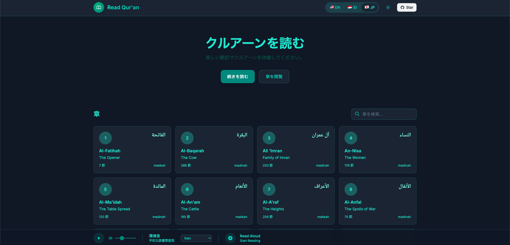

# Read Qur'an

A beautiful, user-friendly web application for reading the Qur'an in multiple languages with ambient background sounds for a peaceful reading experience.

## Features

- **Multi-language Support**: Read translations in English, Bahasa Indonesia, and Japanese (日本語)
- **Ambient Background Audio**: Calm, soothing tones for meditation while reading
- **Audible-like UX**: Clean interface with progress tracking and bookmarks
- **Smooth Animations**: Elegant transitions and hover effects throughout
- **Responsive Design**: Works beautifully on desktop, tablet, and mobile
- **Dark Mode**: Easy on the eyes for night reading
- **Keyboard Shortcuts**:
  - `Space` - Toggle read aloud (start/stop continuous reading)
  - `Shift + ←` - Previous Surah
  - `Shift + →` - Next Surah

## Live Application

Visit the app: [https://arufian.github.io/read-quran](https://arufian.github.io/read-quran)

## How to Use

1. **Select Language**: Choose your preferred language from the dropdown in the top-right
2. **Browse Surahs**: Click on any Surah card to start reading
3. **Toggle Ambient Audio**: Click the play button in the bottom audio bar for calming background sounds
4. **Bookmark Verses**: Click the star icon next to any verse to bookmark it
5. **Continue Reading**: The app remembers where you left off - click "Continue Reading" to resume

## Technical Details

- **API**: Uses [Quran.com API](https://api.quran.com) for translations and chapter data
- **Styling**: Tailwind CSS with custom animations
- **Audio**: HTML5 Audio with real nature sounds (birds, rain, ocean waves)
- **Storage**: LocalStorage for bookmarks, reading progress, and preferences
- **Caching**: Service Worker for offline reading capability

## Translation Authors

| Language          | Author                                   |
| ----------------- | ---------------------------------------- |
| English           | Saheeh International                     |
| Bahasa Indonesia  | Indonesian Ministry of Religious Affairs |
| Japanese (日本語) | Saeed Sato                               |

## Contributing

We welcome contributions! Here's how you can help:

### Report Bugs

- Use the [GitHub Issues](https://github.com/arufian/read-quran/issues) page
- Describe the bug and include steps to reproduce
- Include browser and device information

### Suggest Features

- Open a new issue with the `enhancement` label
- Describe the feature and why it would be useful

### Submit Code Changes

1. Fork the repository
2. Create a new branch: `git checkout -b feature/your-feature-name`
3. Make your changes
4. Test thoroughly
5. Commit with clear messages: `git commit -m "Add: feature description"`
6. Push to your fork: `git push origin feature/your-feature-name`
7. Open a Pull Request

### Development Guidelines

- Keep code clean and well-commented
- Follow existing code style
- Test in multiple browsers if possible
- Update README if adding new features

## Roadmap

- [ ] Add more language translations
- [ ] Implement text search within Surahs
- [ ] Add tafsir (explanation) support
- [ ] Create mobile app version
- [ ] Add audio recitation (Qari)

## Credits

- Translations provided by [Quran.com](https://quran.com)
- Design inspired by Amazon Audible's clean reading interface
- Icons from [Lucide](https://lucide.dev)
- Nature audio from free sound resources

## License

MIT License - Feel free to use, modify, and distribute!

See [LICENSE](LICENSE) file for full details.

## Support

If you find this project helpful, please consider:

- ⭐ Starring the repository
- 🐛 Reporting issues
- 🔧 Contributing code
- 📢 Sharing with others

---

_Made with love for peaceful Qur'an reading_ ☪️
